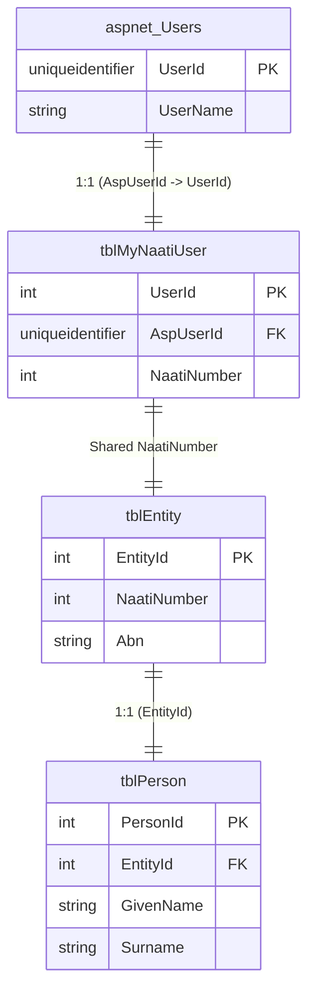
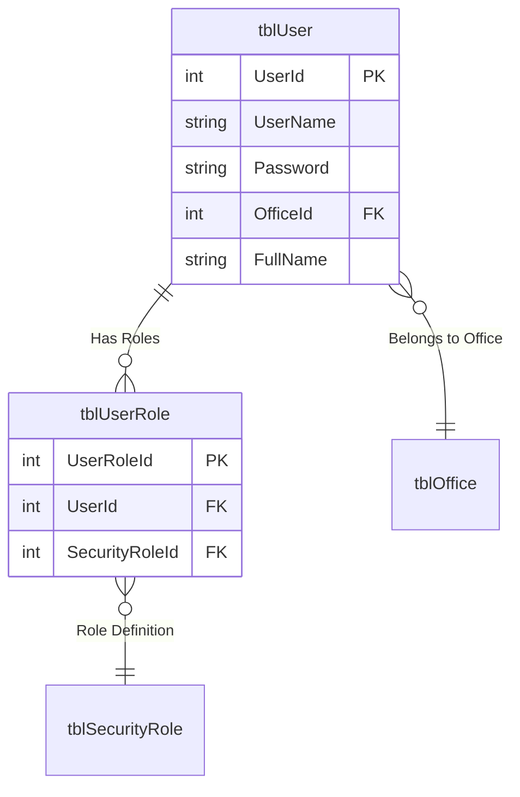

# MyNaati & NCMS Authentication and Database Schema Research

This document outlines the authentication mechanisms and database schema relationships for the MyNaati (Public Portal) and NCMS (Internal Staff) applications.

## Overview

*   **MyNaati (External)**: Uses ASP.NET Forms Authentication with a custom `SqlMembershipProvider`. User accounts are stored in standard ASP.NET Membership tables (`aspnet_Users`) and linked to domain-specific tables (`tblMyNaatiUser`, `tblEntity`, `tblPerson`).
*   **NCMS (Internal)**: Uses ASP.NET Forms Authentication backed by a custom [UserService](file:///d:/naati-productionsourcecode/Ncms.Bl/UserService.cs#23-253). User accounts are stored in a separate `tblUser` table, distinct from external users.

---

## 1. MyNaati (External Portal)

### Authentication Flow
1.  **Login**: User submits credentials to `~/Account/LogOn`.
2.  **Validation**: `MyNaati.Bl.Portal.Security.CustomMembershipProvider` (inheriting from `SqlMembershipProvider`) validates the username and password against the `aspnet_Membership` and `aspnet_Users` tables.
3.  **Session**: On success, an authentication cookie named `"MYNAATI"` is issued.
4.  **Request Handling**: [Global.asax.cs](file:///d:/naati-productionsourcecode/Ncms.Ui/Global.asax.cs) intercepts requests, decrypts the cookie, and establishes the user principal.

### Database Schema & Relationships
The user identity spans several tables to link the login account with the business entity and person details.

#### Key Tables
*   **`aspnet_Users`**: Stores the login account details (Username, UserId (GUID)).
*   **`tblMyNaatiUser`**: Links the ASP.NET account to the NAATI business domain.
*   **`tblEntity`**: Represents the core business entity (can be a person or organization).
*   **`tblPerson`**: Stores personal details (Name, DOB, etc.) for the entity.

#### Relationships

*   **Link 1 (`aspnet_Users` -> `tblMyNaatiUser`)**: The `AspUserId` column in `tblMyNaatiUser` allows looking up the MyNaati record using the logged-in user's GUID.
*   **Link 2 (`tblMyNaatiUser` -> `tblEntity`)**: Both tables share the [NaatiNumber](file:///d:/naati-productionsourcecode/F1Solutions.Naati.Common.Dal.Domain/Person.cs#225-229). This number acts as the bridge between the web account and the core entity record.
*   **Link 3 (`tblEntity` -> `tblPerson`)**: The `tblPerson` table has a foreign key `EntityId` linking it to `tblEntity`.

---

## 2. NCMS (Internal Management System)

### Authentication Flow
1.  **Login**: User submits credentials to `/login`.
2.  **Validation**: [UserService](file:///d:/naati-productionsourcecode/Ncms.Bl/UserService.cs#23-253) (implementing `IUserService`) validates credentials. It checks the `tblUser` table directly.
3.  **Roles**: `Ncms.Ui.Security.RoleProvider` retrieves roles using `IUserService`, which queries `tblUserRole` and related tables.
4.  **Session**: An authentication cookie named `"NCMS"` is used.

### Database Schema & Relationships
NCMS users are considered internal staff and are stored separately from external MyNaati users.

#### Key Tables
*   **`tblUser`**: The primary table for internal staff accounts. Contains both auth credentials (password hash) and profile info (Office, FullName).
*   **`tblUserRole`**: Associates users with roles.
*   **`tblSecurityRole`**: Defines the available roles.

#### Relationships

*   **Data Separation**: `tblUser` is distinct from `aspnet_Users`. Internal staff do not usually have `tblMyNaatiUser` records unless they also have a separate external account.
*   **Permissions**: Permissions are managed via `tblUserRole`, `tblSecurityRole`, and granular permissions in `tblSecurityRule` / `tblSecurityNoun`.

---

## Summary of User Types

| User Type | Application | Auth Provider | Primary Table | Profile Data |
| :--- | :--- | :--- | :--- | :--- |
| **Applicant / Practitioner** | MyNaati | `SqlMembershipProvider` | `aspnet_Users` | `tblPerson` (via `tblMyNaatiUser` & `tblEntity`) |
| **Internal Staff** | NCMS | Custom [UserService](file:///d:/naati-productionsourcecode/Ncms.Bl/UserService.cs#23-253) | `tblUser` | `tblUser` |

