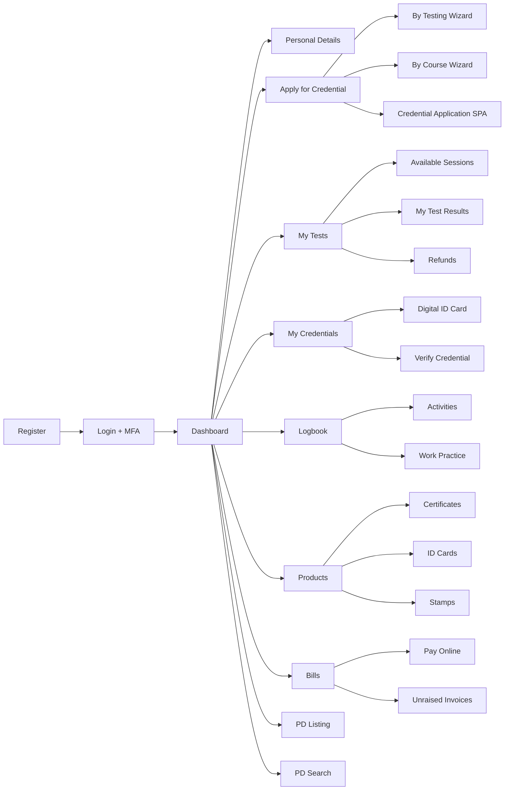

# MyNaati UI — Module Breakdown

A comprehensive listing of every module in the MyNaati UI application, what each module contains, and the key backend services powering it.

---

## 1. Home / Dashboard

| Component | Description |
|-----------|-------------|
| Landing page | Main dashboard for logged-in users |
| Welcome message | Personalized greeting |
| About page | NAATI information |
| Learn More | Service descriptions |
| Diagnostics | System health (admin only) |
| Validate Examiner | Examiner credential validation |
| Help system | Context-sensitive help window + menu |

**Controller:** [HomeController.cs](file:///d:/naati-productionsourcecode/Ncms.Ui/Controllers/HomeController.cs)  
**Backend:** Static content, system status via `ISystemValuesCacheQueryService`  
**DB Entities:** `SystemValue`, `Person`

---

## 2. Account & Authentication

| Component | Description |
|-----------|-------------|
| Login (`LogOn`) | Username/password authentication |
| Registration | New user sign-up form |
| Manual Registration | Admin-created accounts |
| Password Reset | Forgot password flow |
| Change Password | Update existing password |
| Change Login Email | Update login email address |
| MFA Setup | Multi-factor authentication configuration |
| MFA Verification | Enter MFA code during login |
| Access Code Entry | Single-use access code verification |
| User Search | Admin — search registered users |
| Registration Management | Admin — manage pending registrations |
| Duplicate User Resolution | Admin — merge duplicate accounts |

**Controller:** `AccountController.cs`  
**Key Services:** `MembershipProviderService`, `UserService`, `PasswordService`, `EmailCodeVerificationService`  
**DB Entities:** `User`, `MyNaatiUser`, `Person`, `Role`

---

## 3. Personal Details

| Component | Description |
|-----------|-------------|
| Personal info editor | Name, DOB, gender, title |
| Address management | Add/edit/delete addresses (with Google Maps autocomplete) |
| Email management | Multiple email addresses |
| Phone management | Multiple phone numbers |
| Photo upload | Profile image management |
| Aboriginal/Torres Strait identity | Optional identity declaration |

**Controller:** `PersonalDetailsController.cs`  
**Key Service:** [PersonalDetailsService.cs](file:///d:/naati-productionsourcecode/MyNaati.Bl/BackOffice/PersonalDetailsService.cs) (34KB — largest service)  
**ViewModels:** `PersonalDetailsModel`, `AddressEditModel`, `AddressEditGoogleModel`, `PhoneEditModel`, `EmailEditModel`, `WebSiteEditModel`, `AddressListViewModel`, `EmailListViewModel`, `PhoneListViewModel`  
**DB Entities:** `Person`, `Address`, `Email`, `PersonName`, `PersonImage`, `State`, `Suburb`, `Title`

---

## 4. Credential Application *(Core SPA Module — most complex)*

| Component | Description |
|-----------|-------------|
| Application SPA root | Multi-step Durandal/KnockoutJS wizard |
| Credential selector | Choose credential type to apply for |
| Language selector | Select language pair |
| Fee calculator | Dynamic fee calculation |
| Test session picker | Browse and select test sessions |
| Photo upload | Candidate photo for application |
| Document upload | Upload supporting documents (Dropzone) |
| Person details confirmation | Verify personal details before submission |
| Identity verification | Identity verification step |
| In-progress credentials | View credentials currently being processed |
| Future credentials | View upcoming credential opportunities |
| Upgrade selector | Upgrade/cross-skill credential paths |
| Submission result | Application confirmation page |

**Controller:** `CredentialApplicationController.cs`  
**Key Services:** [CredentialApplicationService.cs](file:///d:/naati-productionsourcecode/MyNaati.Bl/BackOffice/CredentialApplicationService.cs) (93KB — **largest file in codebase**), [ApplicationFormHelper.cs](file:///d:/naati-productionsourcecode/MyNaati.Bl/BackOffice/ApplicationFormHelper.cs) (63KB), `ApplicationBusinessLogicService.cs`, `ApplicationFormsService`  
**ViewModels (20+):** `CredentialApplicationModel`, `CredentialRequestModel`, `ApplicationFormQuestionModel`, `ApplicationFormSectionModel`, `SaveApplicationFormRequestModel`, `SubmitApplicationResponse`, `PayOnlineResponseModel`, `RefundViewModel`, `PersonVerificationModel`, etc.  
**DB Entities:** `CredentialApplication`, `CredentialApplicationForm`, `CredentialApplicationFormSection`, `CredentialApplicationFormQuestion`, `CredentialApplicationFieldMap`, `CredentialRequest`, `CredentialApplicationType`, `CredentialApplicationRefundPolicy`

---

## 5. Applications (Testing Track)

| Component | Description |
|-----------|-------------|
| Applications overview | Summary of all applications |
| Available test sessions | Browse bookable test sessions |
| My Tests | View allocated/upcoming tests |
| My Test Results | View past test results |
| Manage Test | Individual test management (18KB view) |
| Select Test Session | SPA — test session picker |
| Supplementary Test | SPA — request supplementary test |
| Apply for Paid Review | SPA — paid review application |
| Expression of Interest | EOI submissions |
| Refund Details | Refund information display |

**Controller:** `ApplicationsController.cs`  
**Backend:** [ApplicationService.cs](file:///d:/naati-productionsourcecode/MyNaati.Bl/Portal/ApplicationService.cs), [CredentialApplicationService.cs](file:///d:/naati-productionsourcecode/MyNaati.Bl/BackOffice/CredentialApplicationService.cs)  
**DB Entities:** `TestSession`, `TestSitting`, `TestAttendance`, `TestResult`, `TestSpecification`, `TestLocation`

---

## 6. Application Wizards

### 6.1 By Testing Wizard (14 views)

| Component | Description |
|-----------|-------------|
| Eligibility check | Eligibility assessment (Advanced, Paraprofessional, Professional) |
| Language proficiency | Language proficiency declaration |
| Test details | Test configuration |
| Test location | Location selection |
| Test fees | Fee display and payment |
| Download form | Downloadable application form |

**ViewModels:** `ApplicationByTestingWizardModel`, `TestEditModel`, `TestDetailsModel`, `TestLocationModel`, `LanguageProficiencyModel`, `TestingFeesModel`, `AdvancedTranslatorEligibilityModel`, `ParaprofessionalEligibilityModel`, `ProfessionalEligibilityModel`

### 6.2 By Course Wizard (9 views)

| Component | Description |
|-----------|-------------|
| Course details | Course information entry |
| Credential details | Credential selection |
| Course fees | Fee calculation |
| Download form | Downloadable form |

**ViewModels:** `ApplicationByCourseWizardModel`, `ApplicationByCourseFormModel`, `CourseDetailsModel`, `CredentialDetailsModel`, `CourseFeesModel`

### 6.3 Shared Wizard Components (11 SPA views)

Question type controls: text, date, checkbox, list/dropdown, email, recertification credential logic

---

## 7. Credentials

| Component | Description |
|-----------|-------------|
| Credential list | All issued credentials |
| Credential detail | Individual credential view with components |
| Digital ID Card | Digital credential card display |

**Controller:** `CredentialController.cs`  
**ViewModels:** `CredentialDetailRequestModel`, `CredentialIdCardModel`  
**DB Entities:** `Credential`, `CredentialType`, `CredentialRequest`, `IssuedCredentialCredentialRequest`

---

## 8. Examiner Tools

| Component | Description |
|-----------|-------------|
| Examiner dashboard | Overview of examiner tasks |
| Manage Tests | Test assignment management |
| Standard Test marking | Standard marking interface |
| Rubric Test marking | Rubric-based marking (15KB view with competencies, bands, criteria) |
| Submit Test Results | Result submission form (23KB — **largest single view**) |
| Advise Availability | Set availability periods |
| Manage Test Materials | SPA — material list and management |
| Submit New Test Material | New material submission form |
| Marking Payment Status | Payroll/payment tracking |
| Material Creation Payments | Material creation payment tracking |
| Panel Management | Panel administration |
| Role Play Sessions | Role play session list and management (16KB) |

**Controller:** `ExaminerToolsController.cs`  
**Key Services:** [ExaminerToolsService.cs](file:///d:/naati-productionsourcecode/MyNaati.Bl/BackOffice/ExaminerToolsService.cs) (64KB — second largest), [ExaminerToolsInternalService.cs](file:///d:/naati-productionsourcecode/MyNaati.Bl/Portal/ExaminerToolsInternalService.cs), [MaterialRequestService.cs](file:///d:/naati-productionsourcecode/MyNaati.Bl/BackOffice/MaterialRequestService.cs), [PanelMembershipService.cs](file:///d:/naati-productionsourcecode/MyNaati.Bl/BackOffice/PanelMembershipService.cs)  
**DB Entities:** `Job`, `JobExaminer`, `TestSitting`, `TestAttendance`, `TestComponent`, `TestComponentType`, `ExaminerMarking`, `ExaminerTestComponentResult`, `RubricMarkingAssessmentCriterion`, `RubricMarkingBand`, `RubricMarkingCompetency`, `RubricAssessmentCriterionResult`, `RubricTestComponentResult`, `TestResult`, `TestMaterial`, `TestMaterialAttachment`, `MaterialRequest`, `MaterialRequestPanelMembership`, `MaterialRequestRound`, `Panel`, `PanelMembership`, `RolePlayer`, `TestSessionRolePlayer`, `JobExaminerPayrollStatus`

---

## 9. Bills & Invoices

| Component | Description |
|-----------|-------------|
| Invoice list | SPA — browse all invoices |
| Single invoice view | Invoice detail |
| Pay Online | Payment form (SecurePay/PayPal integration, 16KB) |
| Payment success | Payment confirmation |

**Controller:** `BillsController.cs`  
**Key Services:** [AccountingService.cs](file:///d:/naati-productionsourcecode/MyNaati.Bl/BackOffice/AccountingService.cs), `SecurePayAuthorisationService`, `PayPalService`, `WiiseIntegrationService`  
**DB Entities:** `Invoice`, `InvoiceLine`, `InvoiceBatch`, `Payment`, `BankDeposit`, `Order`

---

## 10. Unraised Invoices

| Component | Description |
|-----------|-------------|
| Unraised invoice list | SPA — pending invoices |
| Raise & Pay Invoice | SPA — raise and pay in one step |
| Payment information | Payment method entry |
| Payment success | Confirmation |

**Controller:** `UnraisedInvoicesController.cs`  
**Key Services:** [UnraisedInvoiceService.cs](file:///d:/naati-productionsourcecode/MyNaati.Bl/BackOffice/UnraisedInvoiceService.cs), [AccountingService.cs](file:///d:/naati-productionsourcecode/MyNaati.Bl/BackOffice/AccountingService.cs)  
**DB Entities:** `Invoice`, `Payment`, `Order`

---

## 11. Product Purchases

All three sub-modules follow the same **multi-step wizard pattern**: Select → Order Form → Declaration → Review → Payment → Success.

### 11.1 Certificate Purchase

| Step | Description |
|------|-------------|
| Select | Choose credential for certificate |
| Order Form | Enter order details |
| Declaration | Accept terms and conditions |
| Review | Confirm order summary |
| Payment | Process payment |
| Success | Order confirmation |

### 11.2 ID Card Purchase

| Step | Description |
|------|-------------|
| Select | Choose ID card type |
| Order Form | Enter order details (8.5KB — includes photo upload) |
| Photograph | Upload photo for ID card |
| Declaration | Accept terms and conditions |
| Review | Confirm order summary |
| Payment | Process payment |
| Success | Order confirmation |

### 11.3 Stamp Purchase

| Step | Description |
|------|-------------|
| Select | Choose stamp type |
| Order Form | Enter order details |
| Declaration | Accept terms and conditions |
| Review | Confirm order summary |
| Payment | Process payment |
| Success | Order confirmation |

**Key Services:** [OrderService.cs](file:///d:/naati-productionsourcecode/MyNaati.Bl/Portal/OrderService.cs), [ProductSpecificationService.cs](file:///d:/naati-productionsourcecode/MyNaati.Bl/BackOffice/ProductSpecificationService.cs)  
**DB Entities:** `Order`, `Payment`, `AccreditationProduct`, `Invoice`

---

## 12. Logbook (Professional Development)

| Component | Description |
|-----------|-------------|
| Logbook SPA root | Main logbook interface |
| Dashboard | PD summary with progress |
| Credential view | Credential-specific PD tracking |
| PD Activity tracking | Log professional development activities |
| Activity editor | Add/edit PD activities |
| Work Practice editor | Log work practice hours |
| Attachments | Upload supporting documents |
| Period selector | Switch between certification periods |

**Controller:** [LogbookController.cs](file:///d:/naati-productionsourcecode/Ncms.Ui/Controllers/Api/LogbookController.cs)  
**Key Service:** [LogbookService.cs](file:///d:/naati-productionsourcecode/MyNaati.Bl/BackOffice/LogbookService.cs) (18KB)  
**DB Entities:** `ProfessionalDevelopmentActivity`, `ProfessionalDevelopmentCategory`, `ProfessionalDevelopmentSection`, `WorkPractice`, `CertificationPeriod`, `Credential`

---

## 13. Practitioner Directory (PD) Listing

19 views covering the full wizard flow for registering in the public practitioner directory.

| Component | Description |
|-----------|-------------|
| Listing wizard | Full registration wizard |
| Address details | Contact address for listing |
| Contact details | Phone/email for listing |
| Credentials selection | Which credentials to list |
| Work areas | Service areas/specializations |
| Declaration | Terms acceptance |
| Order & Payment | Fee and payment |
| Review & Confirm | Final review |

**Controller:** `PDSearchController.cs`  
**Key Services:** [PractitionerDirectoryService.cs](file:///d:/naati-productionsourcecode/MyNaati.Bl/BackOffice/PractitionerDirectoryService.cs) (20KB), [PractitionerDataService.cs](file:///d:/naati-productionsourcecode/MyNaati.Bl/Portal/PractitionerDataService.cs), [LegacyPractitionerDataService.cs](file:///d:/naati-productionsourcecode/MyNaati.Bl/Portal/LegacyPractitionerDataService.cs)  
**DB Entities:** `Person`, `Address`, `Credential`, `PDInclusion`, `Order`, `Payment`

---

## 14. PD Search (Online Directory)

| Component | Description |
|-----------|-------------|
| Credential search | Search practitioners by credential type |
| Contact details result | View practitioner contact info |
| Verify credentials | Credential verification lookup |
| Practitioner credentials view | Detailed practitioner credential list |
| Online Directory SPA | SPA-based directory search interface |

**Controllers:** `PDSearchController.cs`, `OnlineDirectoryController.cs`  
**API:** `PDSearchApiController.cs`  
**Key Services:** [PractitionerDirectoryService.cs](file:///d:/naati-productionsourcecode/MyNaati.Bl/BackOffice/PractitionerDirectoryService.cs), `OnlineDirectorySearch` helper  
**DB Entities:** `Person`, `Credential`, `Address`, `PDInclusion`

---

## 15. Verify Credential / Verify Practitioner

| Component | Description |
|-----------|-------------|
| Verify Credential | Verify via QR code or reference number |
| Verify Practitioner | Verify a practitioner's current status |

**Controllers:** `VerifyCredentialController.cs`, `VerifyPractitionerController.cs`  
**Key Service:** `CredentialQrCodeService`  
**DB Entities:** `Credential`, `Person`

---

## 16. Configuration

| Component | Description |
|-----------|-------------|
| System configuration | View/manage system settings |

**Controller:** `ConfigurationController.cs`  
**Key Service:** [ConfigurationService.cs](file:///d:/naati-productionsourcecode/MyNaati.Bl/Portal/ConfigurationService.cs)  
**DB Entities:** `SystemValue`

---

## 17. File Management

| Component | Description |
|-----------|-------------|
| File listing | Browse uploaded files |
| File download | Download files (Azure Blob or local storage) |
| File upload | Upload new files |

**Controller:** `FileController.cs`  
**Key Services:** [FileService.cs](file:///d:/naati-productionsourcecode/MyNaati.Bl/Portal/FileService.cs), `ISharedAccessSignature` (Azure Blob or local storage)

---

## 18. API Layer

| Controller | URL Pattern | Purpose |
|------------|-------------|---------|
| `BaseApiController.cs` | `/api/` | Base class for all API controllers |
| `AccountApiController.cs` | `/api/account/*` | Account operations (login, register) |
| `PDSearchApiController.cs` | `/api/pdsearch/*` | PD search AJAX endpoints |
| `PrivateApiController.cs` | `/api/private/*` | Internal API (HMAC authenticated) |
| `PublicController.cs` (v1.0) | `/api/1.0/*` | Public API v1 |
| `ApiV2Controller.cs` (v2.0) | `/api/2.0/*` | Public API v2 |

**Key Service:** [ApiPublicService.cs](file:///d:/naati-productionsourcecode/MyNaati.Bl/BackOffice/ApiPublicService.cs) (40KB)

---

## 19. Lifecycle & Background Tasks

| Component | Description |
|-----------|-------------|
| Lifecycle endpoints | App health checks, startup/shutdown hooks |
| Refresh Pending Users | Background task — cache refresh |
| Background Task Service | Hangfire scheduled task runner |
| Task Logger | Background task logging |

**Controller:** `LifecycleController.cs`

---

## 20. Shared Views & Partials

57 shared partials used across multiple modules:

| Partial | Purpose |
|---------|---------|
| [_LogOn.cshtml](file:///d:/naati-productionsourcecode/MyNaati.Ui/Views/Shared/_LogOn.cshtml) | Login form (6KB) |
| [_AuthorizedMenu.cshtml](file:///d:/naati-productionsourcecode/MyNaati.Ui/Views/Shared/_AuthorizedMenu.cshtml) | Authenticated user navigation menu |
| [_PublicMenu.cshtml](file:///d:/naati-productionsourcecode/MyNaati.Ui/Views/Shared/_PublicMenu.cshtml) | Public (unauthenticated) navigation menu |
| [_PaymentDetailsEditPartial.cshtml](file:///d:/naati-productionsourcecode/MyNaati.Ui/Views/Shared/_PaymentDetailsEditPartial.cshtml) | Reusable payment form |
| [_PaymentMethodEditPartial.cshtml](file:///d:/naati-productionsourcecode/MyNaati.Ui/Views/Shared/_PaymentMethodEditPartial.cshtml) | Payment method selector |
| [_OrderTotalViewPartial.cshtml](file:///d:/naati-productionsourcecode/MyNaati.Ui/Views/Shared/_OrderTotalViewPartial.cshtml) | Order total display |
| `_ApplicationForAccreditation*.cshtml` | 9 partials for accreditation form sections |
| [_LoadingOverlayPartial.cshtml](file:///d:/naati-productionsourcecode/MyNaati.Ui/Views/Shared/_LoadingOverlayPartial.cshtml) | Loading spinner overlay |
| [_GoogleAnalytics.cshtml](file:///d:/naati-productionsourcecode/MyNaati.Ui/Views/Shared/_GoogleAnalytics.cshtml) | GA tracking code |
| [Error.cshtml](file:///d:/naati-productionsourcecode/MyNaati.Ui/Views/Shared/Error.cshtml) | Error page |
| [NotFound.cshtml](file:///d:/naati-productionsourcecode/MyNaati.Ui/Views/Shared/NotFound.cshtml) | 404 page |
| [Unauthorized.cshtml](file:///d:/naati-productionsourcecode/MyNaati.Ui/Views/Shared/Unauthorized.cshtml) | 403 page |
| [SessionExpired.cshtml](file:///d:/naati-productionsourcecode/MyNaati.Ui/Views/Shared/SessionExpired.cshtml) | Session timeout page |

---

## Module Complexity Ranking

| Rank | Module | Key Service Size | Complexity |
|------|--------|-----------------|------------|
| 1 | Credential Application | 93KB | ██████████ Very High |
| 2 | Examiner Tools | 64KB | ████████░░ High |
| 3 | Application Form Engine | 63KB | ████████░░ High |
| 4 | Public API | 40KB | ███████░░░ Medium-High |
| 5 | Personal Details | 34KB | ██████░░░░ Medium |
| 6 | PD Listing | 21KB | █████░░░░░ Medium |
| 7 | Logbook | 18KB | ████░░░░░░ Medium |
| 8 | Authentication | 18KB | ████░░░░░░ Medium |
| 9 | Bills & Invoices | 11KB | ███░░░░░░░ Low-Medium |
| 10 | Products / Config / Verify | <7KB | ██░░░░░░░░ Low |

---

## Module Interaction Diagram

