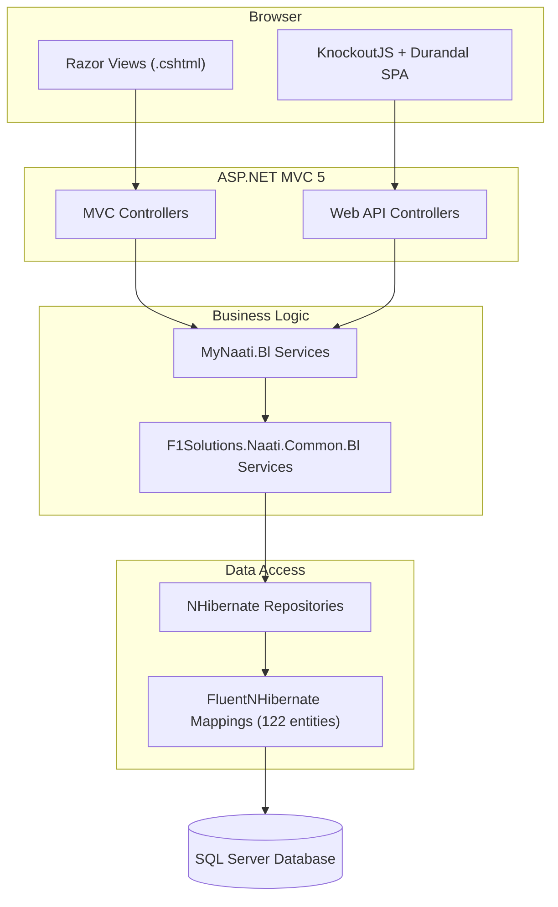
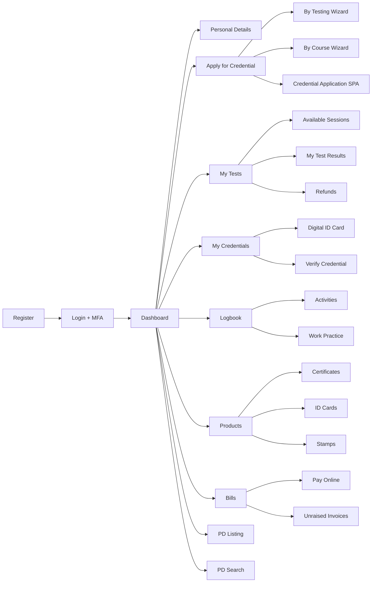

# MyNaati UI — Comprehensive Codebase Documentation

## 1. Project Overview

**MyNaati** is the customer-facing web portal for NAATI (National Accreditation Authority for Translators and Interpreters). It allows practitioners to register, apply for credentials, sit exams, manage certification, purchase products, and maintain professional development records.

| Layer | Technology |
|---|---|
| **Frontend** | ASP.NET MVC 5 Razor Views + **KnockoutJS** + **Durandal SPA** + **RequireJS** |
| **CSS/UI** | Bootstrap 3, Font Awesome, jQuery UI, Chosen, DataTables, Toastr, animate.css |
| **Backend** | ASP.NET MVC 5 / Web API 2, C# (.NET Framework 4.8) |
| **DI Container** | Ninject (Ninject.Modules, Ninject.Extensions.Conventions, Ninject.Extensions.Interception) |
| **ORM** | NHibernate + FluentNHibernate (AutoPersistence model) |
| **Database** | Microsoft SQL Server |
| **Configuration** | Web.config + User.config + Azure Key Vault (switchable via `secrets:Source`) |
| **External Services** | Google Maps API, Google reCAPTCHA, SecurePay SDK, PayPal, Wiise (accounting), Azure Blob Storage |
| **Hosting** | Docker / Azure App Service |

---

## 2. Architecture Diagram



---

## 3. Solution Structure

```
naati-productionsourcecode/
├── MyNaati.Ui/                    # Web project (MVC + SPA)
│   ├── Controllers/               # MVC & API controllers
│   ├── Views/                     # Razor views (27 areas)
│   ├── ViewModels/                # C# view models
│   ├── App/                       # KnockoutJS + Durandal SPA
│   │   ├── main.js                # SPA bootstrap (RequireJS)
│   │   ├── views/                 # SPA view modules (JS + HTML)
│   │   ├── services/              # API requester, enums, utils
│   │   ├── components/            # Reusable KO components
│   │   ├── customBindings/        # KO custom bindings
│   │   └── validationRules/       # KO validation rules
│   ├── Ioc/                       # Ninject DI configuration
│   │   ├── Service.cs             # Main DI module (265 lines)
│   │   ├── NinjectWebCommon.cs    # Ninject bootstrapper
│   │   └── QueryServiceInterceptor.cs
│   ├── Content/                   # CSS, images, fonts
│   ├── Scripts/                   # Third-party JS (jQuery, KO, etc.)
│   ├── Reports/                   # PDF tokenisation & CSV generators
│   ├── Security/                  # Auth attributes, roles
│   ├── Web.config                 # App configuration
│   └── NHibernate.config          # NHibernate session config
│
├── MyNaati.Bl/                    # Business Logic layer
│   ├── BackOffice/                # Core BL services (20 files)
│   ├── Portal/                    # Portal-specific services (15 files)
│   ├── BackgroundTasks/           # Hangfire background jobs
│   └── AutoMappingProfiles/       # AutoMapper profiles
│
├── MyNaati.Contracts/             # Service interfaces
│   ├── BackOffice/                # 70+ interfaces
│   └── Portal/                    # 19 interfaces
│
├── F1Solutions.Naati.Common.Bl/   # Shared business logic
├── F1Solutions.Naati.Common.Dal/  # DAL interfaces + cache queries
├── F1Solutions.Naati.Common.Dal.NHibernate/       # NHibernate session
├── F1Solutions.Naati.Common.Dal.Nhibernate.Mappings/ # 122 entity maps
├── F1Solutions.Naati.Common.Dal.Domain/             # Domain entities
├── F1Solutions.Naati.Common.Contracts/              # Shared contracts
└── F1Solutions.Global.Azure/      # Azure Key Vault + Blob Storage
```

---

## 4. Startup & Initialization Flow

1. **IIS → [Global.asax.cs](file:///d:/naati-productionsourcecode/Ncms.Ui/Global.asax.cs)** — [Application_Start()](file:///d:/naati-productionsourcecode/MyNaati.Ui/Global.asax.cs#81-125) fires
2. **Logging** — Configured via `LoggingHelper`
3. **Ninject DI** — [NinjectWebCommon.cs](file:///d:/naati-productionsourcecode/MyNaati.Ui/Ioc/NinjectWebCommon.cs) bootstraps, loads [Service.cs](file:///d:/naati-productionsourcecode/MyNaati.Ui/Ioc/Service.cs)
4. **Secrets** — `secrets:Source` setting determines provider:
   - `"AppConfig"` → [SecretsProvider](file:///d:/naati-productionsourcecode/F1Solutions.Naati.Common.Bl/Security/SecretsProvider.cs#7-18) reads from `ConfigurationManager.AppSettings`
   - `"AzureKeyVault"` → `Azure.KeyVault.SecretsProvider` reads from Azure Key Vault
5. **NHibernate** — [NHibernateInitializer](file:///d:/naati-productionsourcecode/F1Solutions.Naati.Common.Dal.NHibernate/Configuration/NHibernateInitializer.cs#50-93) calls `NHibernateSession.Init()` with the [ConnectionString](file:///d:/naati-productionsourcecode/MyNaati.Ui/Global.asax.cs#176-181) secret
6. **AutoMapper** — Profiles registered from `MembershipProfile` assembly
7. **Routes** — Standard MVC + Web API routes registered

---

## 5. Database Connection

```mermaid
sequenceDiagram
    participant App as Application_Start
    participant DI as Ninject
    participant SP as ISecretsProvider
    participant Cache as SecretsCacheQueryService
    participant NH as NHibernateSession

    App->>DI: Resolve ISecretsCacheQueryService
    DI->>Cache: Create instance
    App->>Cache: Get("ConnectionString")
    Cache->>SP: Get("ConnectionString")
    SP-->>Cache: "Server=...;Database=..."
    Cache-->>App: Connection string
    App->>NH: Init(connectionString, mappings)
    NH-->>App: SessionFactory ready
```

**NHibernate Config** ([NHibernate.config](file:///d:/naati-productionsourcecode/MyNaati.Ui/NHibernate.config)):
- Dialect: `CustomMsSqlDialect`
- Batch size: 500
- Audit listeners on pre/post insert, update, delete (`MyNaatiAuditListener`)

---

## 6. Frontend Architecture

### 6.1 Dual Rendering Approach

MyNaati uses a **hybrid** approach:

| Rendering | Technology | Used For |
|---|---|---|
| **Server-side** | ASP.NET Razor (.cshtml) | Initial page load, layout, forms, server-round-trip pages |
| **Client-side SPA** | KnockoutJS + Durandal | Dynamic data-bound pages (e.g., Credential Applications, Logbook, Invoice, Online Directory) |

### 6.2 Master Page Layouts

13 layout templates in [Views/Shared/MasterPages/](file:///d:/naati-productionsourcecode/MyNaati.Ui/Views/Shared/MasterPages):

| Layout | Purpose |
|---|---|
| [_Layout.cshtml](file:///d:/naati-productionsourcecode/MyNaati.Ui/Views/PDSearch/_Layout.cshtml) | **Main layout** — navbar, NAATI logo, breadcrumbs, footer, Google Analytics |
| [_KnockoutLayout.cshtml](file:///d:/naati-productionsourcecode/MyNaati.Ui/Views/Shared/MasterPages/_KnockoutLayout.cshtml) | SPA host — contains `#applicationHost` for Durandal |
| [_ApplicationWizardLayout.cshtml](file:///d:/naati-productionsourcecode/MyNaati.Ui/Views/Shared/MasterPages/_ApplicationWizardLayout.cshtml) | Multi-step application wizards |
| [_WizardLayout.cshtml](file:///d:/naati-productionsourcecode/MyNaati.Ui/Views/Shared/MasterPages/_WizardLayout.cshtml) | Generic wizard container |
| [_ProductWizardLayout.cshtml](file:///d:/naati-productionsourcecode/MyNaati.Ui/Views/Shared/MasterPages/_ProductWizardLayout.cshtml) | Product purchase wizards (stamps, certs, ID cards) |
| [_PDSearchWizardLayout.cshtml](file:///d:/naati-productionsourcecode/MyNaati.Ui/Views/Shared/MasterPages/_PDSearchWizardLayout.cshtml) | Practitioner Directory search layout |
| [_PDListingWizardLayout.cshtml](file:///d:/naati-productionsourcecode/MyNaati.Ui/Views/Shared/MasterPages/_PDListingWizardLayout.cshtml) | PD Listing wizard |
| [_PersonalDetailsLayout.cshtml](file:///d:/naati-productionsourcecode/MyNaati.Ui/Views/Shared/MasterPages/_PersonalDetailsLayout.cshtml) | Personal details management |
| [_PayOnlineLayout.cshtml](file:///d:/naati-productionsourcecode/MyNaati.Ui/Views/Shared/MasterPages/_PayOnlineLayout.cshtml) | Online payment pages |
| [_SideMenuLayout.cshtml](file:///d:/naati-productionsourcecode/MyNaati.Ui/Views/Shared/MasterPages/_SideMenuLayout.cshtml) | Pages with side navigation |
| [_LayoutFluid.cshtml](file:///d:/naati-productionsourcecode/MyNaati.Ui/Views/Shared/MasterPages/_LayoutFluid.cshtml) | Full-width fluid layout |
| [_ApplicationsIntroLayout.cshtml](file:///d:/naati-productionsourcecode/MyNaati.Ui/Views/Shared/MasterPages/_ApplicationsIntroLayout.cshtml) | Applications intro container |
| [_ApplicationIntroLayout.cshtml](file:///d:/naati-productionsourcecode/MyNaati.Ui/Views/Shared/MasterPages/_ApplicationIntroLayout.cshtml) | Single application intro |

### 6.3 SPA Module Structure (App/)

[main.js](file:///d:/naati-productionsourcecode/MyNaati.Ui/App/main.js) boots the Durandal SPA using RequireJS.

**JS Services** (8 files in `App/services/`):

| File | Purpose |
|---|---|
| [requester.js](file:///d:/naati-productionsourcecode/MyNaati.Ui/App/services/requester.js) | Central AJAX service — all API calls go through this |
| [credential-application-service.js](file:///d:/naati-productionsourcecode/MyNaati.Ui/App/services/credential-application-service.js) | Credential application API wrapper |
| [message.js](file:///d:/naati-productionsourcecode/MyNaati.Ui/App/services/message.js) | Toast notification & confirmation dialog service |
| [constant.js](file:///d:/naati-productionsourcecode/MyNaati.Ui/App/services/constant.js) | App-wide constants |
| [enums.js](file:///d:/naati-productionsourcecode/MyNaati.Ui/App/services/enums.js) | Client-side enum definitions |
| [util.js](file:///d:/naati-productionsourcecode/MyNaati.Ui/App/services/util.js) | Utility functions (date formatting, validation, etc.) |
| [queued-query-requester.js](file:///d:/naati-productionsourcecode/MyNaati.Ui/App/services/queued-query-requester.js) | Queued/batched API requests |
| [server-callback-processor.js](file:///d:/naati-productionsourcecode/MyNaati.Ui/App/services/server-callback-processor.js) | Processes server callback responses |

**KO Components** (`App/components/`): Reusable UI components — wizard, loader, credential-selector, select, table

**KO Custom Bindings** (`App/customBindings/`): dropzone, dataTable, sparkline, textCurrency, textDate, fileinput, popover, tooltip, addressAutoComplete, downloadFile, selectIfSingle, bytesToSize

---

## 7. Page-by-Page Breakdown

### 7.1 Home

| View | URL Pattern | Functionality |
|---|---|---|
| [Index.cshtml](file:///d:/naati-productionsourcecode/MyNaati.Ui/Views/Home/Index.cshtml) | `/` or `/Home` | Landing/dashboard page |
| [Welcome.cshtml](file:///d:/naati-productionsourcecode/MyNaati.Ui/Views/Home/Welcome.cshtml) | `/Home/Welcome` | Welcome message for logged-in users |
| [About.cshtml](file:///d:/naati-productionsourcecode/MyNaati.Ui/Views/Home/About.cshtml) | `/Home/About` | About NAATI page |
| [LearnMore.cshtml](file:///d:/naati-productionsourcecode/MyNaati.Ui/Views/Home/LearnMore.cshtml) | `/Home/LearnMore` | Learn more about NAATI services |
| [Diagnostics.cshtml](file:///d:/naati-productionsourcecode/MyNaati.Ui/Views/Home/Diagnostics.cshtml) | `/Home/Diagnostics` | System diagnostics (admin) |
| [ValidateExaminer.cshtml](file:///d:/naati-productionsourcecode/MyNaati.Ui/Views/Home/ValidateExaminer.cshtml) | `/Home/ValidateExaminer` | Examiner validation page |
| [HelpWindow.cshtml](file:///d:/naati-productionsourcecode/MyNaati.Ui/Views/Home/HelpWindow.cshtml) | `/Home/Help` | Help documentation window |
| [HelpContent.cshtml](file:///d:/naati-productionsourcecode/MyNaati.Ui/Views/Home/HelpContent.cshtml) | — | Help content partial |
| [HelpMenu.cshtml](file:///d:/naati-productionsourcecode/MyNaati.Ui/Views/Home/HelpMenu.cshtml) | — | Help navigation menu partial |

**Controller**: [HomeController.cs](file:///d:/naati-productionsourcecode/Ncms.Ui/Controllers/HomeController.cs)
**Backend**: Static content, system status via `ISystemValuesCacheQueryService`
**DB Entities**: `SystemValue`, `Person` (for greeting)

---

### 7.2 Account & Authentication

| View | URL Pattern | Functionality |
|---|---|---|
| [LogOn.cshtml](file:///d:/naati-productionsourcecode/MyNaati.Ui/Views/Account/LogOn.cshtml) | `/Account/LogOn` | Login page |
| [Register.cshtml](file:///d:/naati-productionsourcecode/MyNaati.Ui/Views/Account/Register.cshtml) | `/Account/Register` | New user registration form |
| [RegisterSuccess.cshtml](file:///d:/naati-productionsourcecode/MyNaati.Ui/Views/Account/RegisterSuccess.cshtml) | `/Account/RegisterSuccess` | Registration confirmation |
| [RegisterError.cshtml](file:///d:/naati-productionsourcecode/MyNaati.Ui/Views/Account/RegisterError.cshtml) | `/Account/RegisterError` | Registration error page |
| [ManualRegister.cshtml](file:///d:/naati-productionsourcecode/MyNaati.Ui/Views/Account/ManualRegister.cshtml) | `/Account/ManualRegister` | Manual registration (admin) |
| [ResetPassword.cshtml](file:///d:/naati-productionsourcecode/MyNaati.Ui/Views/Account/ResetPassword.cshtml) | `/Account/ResetPassword` | Password reset form |
| [ResetPasswordSuccess.cshtml](file:///d:/naati-productionsourcecode/MyNaati.Ui/Views/Account/ResetPasswordSuccess.cshtml) | `/Account/ResetPasswordSuccess` | Password reset confirmation |
| [ChangePassword.cshtml](file:///d:/naati-productionsourcecode/MyNaati.Ui/Views/Account/ChangePassword.cshtml) | `/Account/ChangePassword` | Change password form |
| [ChangePasswordSuccess.cshtml](file:///d:/naati-productionsourcecode/MyNaati.Ui/Views/Account/ChangePasswordSuccess.cshtml) | `/Account/ChangePasswordSuccess` | Password change confirmation |
| [ChangeLogOnEmail.cshtml](file:///d:/naati-productionsourcecode/MyNaati.Ui/Views/Account/ChangeLogOnEmail.cshtml) | `/Account/ChangeLogOnEmail` | Change login email |
| [EmailLogonChangeSuccess.cshtml](file:///d:/naati-productionsourcecode/MyNaati.Ui/Views/Account/EmailLogonChangeSuccess.cshtml) | — | Email change confirmation |
| [ChangeLogOnEmailError.cshtml](file:///d:/naati-productionsourcecode/MyNaati.Ui/Views/Account/ChangeLogOnEmailError.cshtml) | — | Email change error |
| [EnterAccessCode.cshtml](file:///d:/naati-productionsourcecode/MyNaati.Ui/Views/Account/EnterAccessCode.cshtml) | `/Account/EnterAccessCode` | Access code entry |
| [SetupMfa.cshtml](file:///d:/naati-productionsourcecode/MyNaati.Ui/Views/Account/SetupMfa.cshtml) | `/Account/SetupMfa` | Multi-factor authentication setup |
| [MultiFactorAuthentication.cshtml](file:///d:/naati-productionsourcecode/MyNaati.Ui/Views/Account/MultiFactorAuthentication.cshtml) | `/Account/Mfa` | MFA verification |
| [ReenterMfa.cshtml](file:///d:/naati-productionsourcecode/MyNaati.Ui/Views/Account/ReenterMfa.cshtml) | `/Account/ReenterMfa` | Re-enter MFA code |
| [Index.cshtml](file:///d:/naati-productionsourcecode/MyNaati.Ui/Views/Home/Index.cshtml) | `/Account` | Account overview |
| [UserSearch.cshtml](file:///d:/naati-productionsourcecode/MyNaati.Ui/Views/Account/UserSearch.cshtml) | `/Account/UserSearch` | Admin user search |
| [Registrations.cshtml](file:///d:/naati-productionsourcecode/MyNaati.Ui/Views/Account/Registrations.cshtml) | `/Account/Registrations` | Admin registration management |
| [DuplicateUserResolution.cshtml](file:///d:/naati-productionsourcecode/MyNaati.Ui/Views/Account/DuplicateUserResolution.cshtml) | `/Account/DuplicateUser` | Duplicate user resolution |

**Controller**: `AccountController.cs`
**Backend**: [MembershipProviderService.cs](file:///d:/naati-productionsourcecode/MyNaati.Bl/Portal/MembershipProviderService.cs), [UserService.cs](file:///d:/naati-productionsourcecode/MyNaati.Bl/Portal/UserService.cs), [PasswordService.cs](file:///d:/naati-productionsourcecode/MyNaati.Bl/Portal/PasswordService.cs), [EmailCodeVerificationService.cs](file:///d:/naati-productionsourcecode/MyNaati.Bl/BackOffice/EmailCodeVerificationService.cs), `FormsAuthenticationService`
**DB Entities**: `User`, `MyNaatiUser`, `Person`, `Role`

---

### 7.3 Personal Details

| View | URL Pattern | Functionality |
|---|---|---|
| [Index.cshtml](file:///d:/naati-productionsourcecode/MyNaati.Ui/Views/Home/Index.cshtml) | `/PersonalDetails` | View & edit personal info (name, DOB, contact, addresses) |

**SPA-rendered**: No — this is a 27KB Razor view with DataTables for address/email/phone lists

**Controller**: `PersonalDetailsController.cs`
**Backend**: [PersonalDetailsService.cs](file:///d:/naati-productionsourcecode/MyNaati.Bl/BackOffice/PersonalDetailsService.cs) (34KB — the largest service), [PractitionerDataService.cs](file:///d:/naati-productionsourcecode/MyNaati.Bl/Portal/PractitionerDataService.cs)
**ViewModels**: `PersonalDetailsModel`, `AddressEditModel`, `AddressEditGoogleModel`, `PhoneEditModel`, `EmailEditModel`, `WebSiteEditModel`, `AddressListViewModel`, `EmailListViewModel`, `PhoneListViewModel`
**DB Entities**: `Person`, `Address`, `Email`, `PersonName`, `PersonImage`, `State`, `Suburb`, `Title`

---

### 7.4 Credential Application (Core SPA Page)

| View | URL Pattern | Functionality |
|---|---|---|
| [Index.cshtml](file:///d:/naati-productionsourcecode/MyNaati.Ui/Views/Home/Index.cshtml) | `/CredentialApplication` | **Main credential application SPA** — Durandal hosts the entire multi-step application process |
| [SubmissionResult.cshtml](file:///d:/naati-productionsourcecode/MyNaati.Ui/Views/CredentialApplication/SubmissionResult.cshtml) | `/CredentialApplication/Result` | Application submission result |

**This is the largest and most complex module.** It uses the Durandal SPA framework entirely.

**SPA Views** (`App/views/credential-application/`): 24 files including:
- `credential-application-index.html/js` — Main application SPA root
- `special-controls/credential-selector.html/js` — Credential type picker
- `special-controls/language-selector.html/js` — Language selection
- `special-controls/fees.html/js` — Fee calculation display
- `special-controls/test-sessions.html/js` — Test session selection
- `special-controls/person-photo.html/js` — Photo upload
- `special-controls/document-upload.html/js` — Document upload (uses Dropzone)
- `special-controls/person-details.html/js` — Person details confirmation
- `special-controls/person-verification.html/js` — Identity verification
- `special-controls/credential-inprogress.html/js` — In-progress credentials
- `special-controls/credential-future.html/js` — Future credentials
- `special-controls/credential-selector-upgrade-same-level.html/js` — Upgrade selection

**Controller**: `CredentialApplicationController.cs`
**API Controller**: Likely handles AJAX calls from the SPA
**Backend**: [CredentialApplicationService.cs](file:///d:/naati-productionsourcecode/MyNaati.Bl/BackOffice/CredentialApplicationService.cs) (**93KB** — largest file), [ApplicationFormHelper.cs](file:///d:/naati-productionsourcecode/MyNaati.Bl/BackOffice/ApplicationFormHelper.cs) (**63KB**), `ApplicationBusinessLogicService.cs`, `ApplicationFormsService`
**ViewModels** (20+ files): `CredentialApplicationModel`, `CredentialRequestModel`, `ApplicationFormQuestionModel`, `ApplicationFormSectionModel`, `SaveApplicationFormRequestModel`, `SubmitApplicationResponse`, `PayOnlineResponseModel`, `RefundViewModel`, `PersonVerificationModel`, etc.
**DB Entities**: `CredentialApplication`, `CredentialApplicationForm`, `CredentialApplicationFormSection`, `CredentialApplicationFormQuestion`, `CredentialApplicationFieldMap`, `CredentialRequest`, `CredentialApplicationType`, `CredentialApplicationRefundPolicy`

---

### 7.5 Applications (Testing Track)

| View | URL Pattern | Functionality |
|---|---|---|
| [Index.cshtml](file:///d:/naati-productionsourcecode/MyNaati.Ui/Views/Home/Index.cshtml) | `/Applications` | Applications overview |
| [AvailableTestSessions.cshtml](file:///d:/naati-productionsourcecode/MyNaati.Ui/Views/Applications/AvailableTestSessions.cshtml) | `/Applications/AvailableTestSessions` | Browse and select test sessions |
| [MyTests.cshtml](file:///d:/naati-productionsourcecode/MyNaati.Ui/Views/Applications/MyTests.cshtml) | `/Applications/MyTests` | View your allocated tests |
| [MyTestResults.cshtml](file:///d:/naati-productionsourcecode/MyNaati.Ui/Views/Applications/MyTestResults.cshtml) | `/Applications/MyTestResults` | View test results |
| [ManageTest.cshtml](file:///d:/naati-productionsourcecode/MyNaati.Ui/Views/Applications/ManageTest.cshtml) | `/Applications/ManageTest` | Manage individual test (18KB view) |
| [RefundDetails.cshtml](file:///d:/naati-productionsourcecode/MyNaati.Ui/Views/Applications/RefundDetails.cshtml) | `/Applications/RefundDetails` | Refund information |
| [SelectTestSession.cshtml](file:///d:/naati-productionsourcecode/MyNaati.Ui/Views/Applications/SelectTestSession.cshtml) | `/Applications/SelectTestSession` | SPA — test session picker |
| [SupplementaryTest.cshtml](file:///d:/naati-productionsourcecode/MyNaati.Ui/Views/Applications/SupplementaryTest.cshtml) | `/Applications/SupplementaryTest` | SPA — supplementary test request |
| [ApplyForAPaidReview.cshtml](file:///d:/naati-productionsourcecode/MyNaati.Ui/Views/Applications/ApplyForAPaidReview.cshtml) | `/Applications/ApplyForAPaidReview` | SPA — paid review application |
| [ExpressionOfInterest.cshtml](file:///d:/naati-productionsourcecode/MyNaati.Ui/Views/Applications/ExpressionOfInterest.cshtml) | `/Applications/ExpressionOfInterest` | EOI for testing |

**SPA Views** (`App/views/applications/`): 12 files including select-test-session, supplementary-test, apply-for-paid-review, payment-control, test-details

**Controller**: `ApplicationsController.cs`
**Backend**: [ApplicationService.cs](file:///d:/naati-productionsourcecode/MyNaati.Bl/Portal/ApplicationService.cs), [CredentialApplicationService.cs](file:///d:/naati-productionsourcecode/MyNaati.Bl/BackOffice/CredentialApplicationService.cs)
**DB Entities**: `TestSession`, `TestSitting`, `TestAttendance`, `TestResult`, `TestSpecification`, `TestLocation`

---

### 7.6 Application Wizards

#### By Testing

| View | Files |
|---|---|
| Wizard directory | 14 views covering: eligibility, language proficiency, test details, test location, test fees, download form |

**ViewModels**: `ApplicationByTestingWizardModel`, `TestEditModel`, `TestDetailsModel`, `TestLocationModel`, `LanguageProficiencyModel`, `TestingFeesModel`, `AdvancedTranslatorEligibilityModel`, `ParaprofessionalEligibilityModel`, `ProfessionalEligibilityModel`

#### By Course

| View | Files |
|---|---|
| Wizard directory | 9 views covering: course details, credential details, course fees, download form |

**ViewModels**: `ApplicationByCourseWizardModel`, `ApplicationByCourseFormModel`, `CourseDetailsModel`, `CredentialDetailsModel`, `CourseFeesModel`

**Shared Wizard SPA** (`App/views/wizard/`): 11 files including question types (text, date, check, list, email), recertification credential logic

---

### 7.7 Credentials

| View | URL Pattern | Functionality |
|---|---|---|
| [Index.cshtml](file:///d:/naati-productionsourcecode/MyNaati.Ui/Views/Home/Index.cshtml) | `/Credential` | List user's credentials |
| [CredentialComponent.cshtml](file:///d:/naati-productionsourcecode/MyNaati.Ui/Views/Credential/CredentialComponent.cshtml) | `/Credential/Component` | Credential detail display |
| [DigitalIDCard.cshtml](file:///d:/naati-productionsourcecode/MyNaati.Ui/Views/Credential/DigitalIDCard.cshtml) | `/Credential/DigitalIDCard` | Digital ID card view |

**Controller**: `CredentialController.cs`
**ViewModels**: `CredentialDetailRequestModel`, `CredentialIdCardModel`
**DB Entities**: `Credential`, `CredentialType`, `CredentialRequest`, `IssuedCredentialCredentialRequest`

---

### 7.8 Examiner Tools

| View | URL Pattern | Functionality |
|---|---|---|
| [Index.cshtml](file:///d:/naati-productionsourcecode/MyNaati.Ui/Views/Home/Index.cshtml) | `/ExaminerTools` | Examiner dashboard |
| [ManageTests.cshtml](file:///d:/naati-productionsourcecode/MyNaati.Ui/Views/ExaminerTools/ManageTests.cshtml) | `/ExaminerTools/ManageTests` | Manage test assignments |
| [StandardTest.cshtml](file:///d:/naati-productionsourcecode/MyNaati.Ui/Views/ExaminerTools/StandardTest.cshtml) | `/ExaminerTools/StandardTest` | Standard marking interface |
| [RubricTest.cshtml](file:///d:/naati-productionsourcecode/MyNaati.Ui/Views/ExaminerTools/RubricTest.cshtml) | `/ExaminerTools/RubricTest` | Rubric-based marking (15KB view) |
| [_SubmitTestResults.cshtml](file:///d:/naati-productionsourcecode/MyNaati.Ui/Views/ExaminerTools/_SubmitTestResults.cshtml) | — | Shared test submission partial (23KB — largest single view) |
| [AdviseAvailability.cshtml](file:///d:/naati-productionsourcecode/MyNaati.Ui/Views/ExaminerTools/AdviseAvailability.cshtml) | `/ExaminerTools/AdviseAvailability` | Set examiner availability |
| [ManageTestMaterials.cshtml](file:///d:/naati-productionsourcecode/MyNaati.Ui/Views/ExaminerTools/ManageTestMaterials.cshtml) | `/ExaminerTools/ManageTestMaterials` | Test materials list |
| [ManageTestMaterial.cshtml](file:///d:/naati-productionsourcecode/MyNaati.Ui/Views/ExaminerTools/ManageTestMaterial.cshtml) | `/ExaminerTools/ManageTestMaterial` | SPA — single material management |
| [SubmitNewTestMaterial.cshtml](file:///d:/naati-productionsourcecode/MyNaati.Ui/Views/ExaminerTools/SubmitNewTestMaterial.cshtml) | `/ExaminerTools/SubmitNewTestMaterial` | New test material submission form |
| [MarkingPaymentStatus.cshtml](file:///d:/naati-productionsourcecode/MyNaati.Ui/Views/ExaminerTools/MarkingPaymentStatus.cshtml) | `/ExaminerTools/MarkingPaymentStatus` | Marking payment/payroll status |
| [TestMaterialCreationPayments.cshtml](file:///d:/naati-productionsourcecode/MyNaati.Ui/Views/ExaminerTools/TestMaterialCreationPayments.cshtml) | `/ExaminerTools/TestMaterialCreationPayments` | Material creation payment tracking |
| [PanelManagement.cshtml](file:///d:/naati-productionsourcecode/MyNaati.Ui/Views/ExaminerTools/PanelManagement.cshtml) | `/ExaminerTools/PanelManagement` | Panel management |
| [RolePlaySession.cshtml](file:///d:/naati-productionsourcecode/MyNaati.Ui/Views/ExaminerTools/RolePlaySession.cshtml) | `/ExaminerTools/RolePlaySession` | Role play session management (16KB) |
| [RolePlaySessions.cshtml](file:///d:/naati-productionsourcecode/MyNaati.Ui/Views/ExaminerTools/RolePlaySessions.cshtml) | `/ExaminerTools/RolePlaySessions` | Role play session list |
| [FileTooLarge.cshtml](file:///d:/naati-productionsourcecode/MyNaati.Ui/Views/ExaminerTools/FileTooLarge.cshtml) | — | Error page for oversized file uploads |

**SPA Views** (`App/views/examiner-tools/`): `manage-test-material.html/js`

**Controller**: `ExaminerToolsController.cs`
**Backend**: [ExaminerToolsService.cs](file:///d:/naati-productionsourcecode/MyNaati.Bl/BackOffice/ExaminerToolsService.cs) (**64KB** — second largest), [ExaminerToolsInternalService.cs](file:///d:/naati-productionsourcecode/MyNaati.Bl/Portal/ExaminerToolsInternalService.cs), [MaterialRequestService.cs](file:///d:/naati-productionsourcecode/MyNaati.Bl/BackOffice/MaterialRequestService.cs), [PanelMembershipService.cs](file:///d:/naati-productionsourcecode/MyNaati.Bl/BackOffice/PanelMembershipService.cs)
**ViewModels**: `IndexModel`, `ManageTestsModel`, `TestModel`, `TestAssessmentModel`, `TestBandModel`, `TestCompetenceModel`, `TestComponentModel`, `TestMaterialModel`, `SubmitTestModel`, `AdviseAvailabilityModel`, `MarkingPayrollHistoryModel`, `PanelManagementModel`, `RolePlayerSettingsModel`, `ManageTestMaterialsModel`, `TestMaterialCreationPaymentsModel`, `MaterialRequestTaskModel`, `MaterialRequestRoundAttachmentModel`, `MaterialRequestRoundLinkModel`, `PostMaterialRequestMembersRequestModel`, `MaterialRequestPanelMembershipModel`, `ExaminerUnavailableModel`
**DB Entities**: `Job`, `JobExaminer`, `TestSitting`, `TestAttendance`, `TestComponent`, `TestComponentType`, `ExaminerMarking`, `ExaminerTestComponentResult`, `RubricMarkingAssessmentCriterion`, `RubricMarkingBand`, `RubricMarkingCompetency`, `RubricAssessmentCriterionResult`, `RubricTestComponentResult`, `TestResult`, `TestMaterial`, `TestMaterialAttachment`, `MaterialRequest`, `MaterialRequestPanelMembership`, `MaterialRequestRound`, `Panel`, `PanelMembership`, `RolePlayer`, `TestSessionRolePlayer`, `JobExaminerPayrollStatus`

---

### 7.9 Bills & Invoices

| View | URL Pattern | Functionality |
|---|---|---|
| [Index.cshtml](file:///d:/naati-productionsourcecode/MyNaati.Ui/Views/Home/Index.cshtml) | `/Bills` | SPA — Invoice list |
| [Invoice.cshtml](file:///d:/naati-productionsourcecode/MyNaati.Ui/Views/Bills/Invoice.cshtml) | `/Bills/Invoice` | Single invoice view |
| [PayOnline.cshtml](file:///d:/naati-productionsourcecode/MyNaati.Ui/Views/Bills/PayOnline.cshtml) | `/Bills/PayOnline` | Online payment form (16KB — SecurePay integration) |
| [PaymentSuccess.cshtml](file:///d:/naati-productionsourcecode/MyNaati.Ui/Views/Bills/PaymentSuccess.cshtml) | `/Bills/PaymentSuccess` | Payment success confirmation |

**SPA Views** (`App/views/invoice/`): `invoice-index.html/js`

**Controller**: `BillsController.cs`
**Backend**: [AccountingService.cs](file:///d:/naati-productionsourcecode/MyNaati.Bl/BackOffice/AccountingService.cs), `SecurePayAuthorisationService`, `PayPalService`, `WiiseIntegrationService`
**ViewModels**: `InvoiceModelRequest`, `PaymentDetailsModel`
**DB Entities**: `Invoice`, `InvoiceLine`, `InvoiceBatch`, `Payment`, `BankDeposit`, `Order`

---

### 7.10 Unraised Invoices

| View | URL Pattern | Functionality |
|---|---|---|
| [Index.cshtml](file:///d:/naati-productionsourcecode/MyNaati.Ui/Views/Home/Index.cshtml) | `/UnraisedInvoices` | SPA — Unraised invoice list |
| [RaiseAndPayInvoice.cshtml](file:///d:/naati-productionsourcecode/MyNaati.Ui/Views/UnraisedInvoices/RaiseAndPayInvoice.cshtml) | `/UnraisedInvoices/RaiseAndPay` | SPA — Raise & pay invoice |
| [PaymentSuccess.cshtml](file:///d:/naati-productionsourcecode/MyNaati.Ui/Views/Bills/PaymentSuccess.cshtml) | `/UnraisedInvoices/PaymentSuccess` | Payment success |

**SPA Views** (`App/views/unraised-invoice/`): 8 files including raise-and-pay-invoice, payment-information, payment-control, unraised-invoice-index

**Controller**: `UnraisedInvoicesController.cs`
**Backend**: [UnraisedInvoiceService.cs](file:///d:/naati-productionsourcecode/MyNaati.Bl/BackOffice/UnraisedInvoiceService.cs), [AccountingService.cs](file:///d:/naati-productionsourcecode/MyNaati.Bl/BackOffice/AccountingService.cs)
**DB Entities**: `Invoice`, `Payment`, `Order`

---

### 7.11 Product Purchases (Certificate, ID Card, Stamp)

All three follow the same **multi-step wizard pattern**: Select → Order Form → Declaration → Review → Payment → Success.

#### Certificate

| View | Description |
|---|---|
| [Index.cshtml](file:///d:/naati-productionsourcecode/MyNaati.Ui/Views/Home/Index.cshtml) | Certificate selection |
| [Select.cshtml](file:///d:/naati-productionsourcecode/MyNaati.Ui/Views/Stamp/Select.cshtml) | Select credential for certificate |
| [OrderForm.cshtml](file:///d:/naati-productionsourcecode/MyNaati.Ui/Views/Stamp/OrderForm.cshtml) | Order form |
| [Declaration.cshtml](file:///d:/naati-productionsourcecode/MyNaati.Ui/Views/Stamp/Declaration.cshtml) | Declaration page |
| [Review.cshtml](file:///d:/naati-productionsourcecode/MyNaati.Ui/Views/Stamp/Review.cshtml) | Order review |
| [OrderSuccess.cshtml](file:///d:/naati-productionsourcecode/MyNaati.Ui/Views/Stamp/OrderSuccess.cshtml) | Order confirmation |

#### ID Card

| View | Description |
|---|---|
| [Index.cshtml](file:///d:/naati-productionsourcecode/MyNaati.Ui/Views/Home/Index.cshtml) | ID card landing |
| [Select.cshtml](file:///d:/naati-productionsourcecode/MyNaati.Ui/Views/Stamp/Select.cshtml) | Select ID card type |
| [OrderForm.cshtml](file:///d:/naati-productionsourcecode/MyNaati.Ui/Views/Stamp/OrderForm.cshtml) | Order form (8.5KB — includes photo upload) |
| [Photograph.cshtml](file:///d:/naati-productionsourcecode/MyNaati.Ui/Views/IdCard/Photograph.cshtml) | Photo upload page |
| [Declaration.cshtml](file:///d:/naati-productionsourcecode/MyNaati.Ui/Views/Stamp/Declaration.cshtml) | Declaration page |
| [Review.cshtml](file:///d:/naati-productionsourcecode/MyNaati.Ui/Views/Stamp/Review.cshtml) | Order review |
| [OrderSuccess.cshtml](file:///d:/naati-productionsourcecode/MyNaati.Ui/Views/Stamp/OrderSuccess.cshtml) | Order confirmation |

#### Stamp

| View | Description |
|---|---|
| [Index.cshtml](file:///d:/naati-productionsourcecode/MyNaati.Ui/Views/Home/Index.cshtml) | Stamp landing |
| [Select.cshtml](file:///d:/naati-productionsourcecode/MyNaati.Ui/Views/Stamp/Select.cshtml) | Select stamp type |
| [OrderForm.cshtml](file:///d:/naati-productionsourcecode/MyNaati.Ui/Views/Stamp/OrderForm.cshtml) | Order form |
| [Declaration.cshtml](file:///d:/naati-productionsourcecode/MyNaati.Ui/Views/Stamp/Declaration.cshtml) / [_DeclarationPartial.cshtml](file:///d:/naati-productionsourcecode/MyNaati.Ui/Views/Stamp/_DeclarationPartial.cshtml) | Declaration pages |
| [Review.cshtml](file:///d:/naati-productionsourcecode/MyNaati.Ui/Views/Stamp/Review.cshtml) | Order review |
| [OrderSuccess.cshtml](file:///d:/naati-productionsourcecode/MyNaati.Ui/Views/Stamp/OrderSuccess.cshtml) | Order confirmation |

**Controllers**: Shared product controller logic
**Backend**: [OrderService.cs](file:///d:/naati-productionsourcecode/MyNaati.Bl/Portal/OrderService.cs), [ProductSpecificationService.cs](file:///d:/naati-productionsourcecode/MyNaati.Bl/BackOffice/ProductSpecificationService.cs)
**ViewModels**: Wizard models, delivery details, payment details, review models
**DB Entities**: `Order`, `Payment`, `AccreditationProduct`, `Invoice`

---

### 7.12 Logbook (Professional Development)

| View | URL Pattern | Functionality |
|---|---|---|
| [Index.cshtml](file:///d:/naati-productionsourcecode/MyNaati.Ui/Views/Home/Index.cshtml) | `/Logbook` | SPA — Full logbook management |

**SPA Views** (`App/views/logbook/`): 18 files including:
- `logbook-index.html/js` — Main logbook SPA root
- `logbook-dashboard.html/js` — Logbook summary dashboard
- `logbook-credential.html/js` — Credential-specific logbook view
- `logbook-professional-development.html/js` — PD activity tracking
- `logbook-activity-edit.html/js` — Add/edit PD activities
- `logbook-work-practice-edit.html/js` — Work practice logging
- `logbook-attachments.html/js` — File attachments
- `logbook-work-practice-attachments.html/js` — Work practice attachments
- `logbook-period-selector.html/js` — Certification period selector

**Controller**: [LogbookController.cs](file:///d:/naati-productionsourcecode/Ncms.Ui/Controllers/Api/LogbookController.cs)
**Backend**: [LogbookService.cs](file:///d:/naati-productionsourcecode/MyNaati.Bl/BackOffice/LogbookService.cs) (18KB)
**DB Entities**: `ProfessionalDevelopmentActivity`, `ProfessionalDevelopmentCategory`, `ProfessionalDevelopmentSection`, `WorkPractice`, `CertificationPeriod`, `Credential`

---

### 7.13 Practitioner Directory (PD) Listing

| View | URL Pattern | Functionality |
|---|---|---|
| [Index.cshtml](file:///d:/naati-productionsourcecode/MyNaati.Ui/Views/Home/Index.cshtml) | `/PDListing` | Main PD listing wizard (8KB) |
| + 18 sub-views | — | Address, contact details, credentials, work areas, declaration, order form, payment, review, confirmation |

19 views total covering the full wizard flow for registering in the practitioner directory.

**Controller**: Related to `PDSearchController.cs` and PD listing logic
**Backend**: [PractitionerDirectoryService.cs](file:///d:/naati-productionsourcecode/MyNaati.Bl/BackOffice/PractitionerDirectoryService.cs) (20KB), [PractitionerDataService.cs](file:///d:/naati-productionsourcecode/MyNaati.Bl/Portal/PractitionerDataService.cs), [LegacyPractitionerDataService.cs](file:///d:/naati-productionsourcecode/MyNaati.Bl/Portal/LegacyPractitionerDataService.cs)
**DB Entities**: `Person`, `Address`, `Credential`, `PDInclusion`, `Order`, `Payment`

---

### 7.14 PD Search (Online Directory)

| View | URL Pattern | Functionality |
|---|---|---|
| [Credentials.cshtml](file:///d:/naati-productionsourcecode/MyNaati.Ui/Views/PDSearch/Credentials.cshtml) | `/PDSearch/Credentials` | Search by credentials |
| [ContactDetails.cshtml](file:///d:/naati-productionsourcecode/MyNaati.Ui/Views/PDSearch/ContactDetails.cshtml) | `/PDSearch/ContactDetails` | Contact details result |
| [VerifyCredentials.cshtml](file:///d:/naati-productionsourcecode/MyNaati.Ui/Views/PDSearch/VerifyCredentials.cshtml) | `/PDSearch/VerifyCredentials` | Credential verification |
| [PractitionerCredentials.cshtml](file:///d:/naati-productionsourcecode/MyNaati.Ui/Views/PDSearch/PractitionerCredentials.cshtml) | `/PDSearch/PractitionerCredentials` | Practitioner credentials view |
| [_Layout.cshtml](file:///d:/naati-productionsourcecode/MyNaati.Ui/Views/PDSearch/_Layout.cshtml) | — | PD Search specific layout |

**SPA Page**: `App/views/online-directory/online-directory-index.html/js`

**Controller**: `PDSearchController.cs`, `OnlineDirectoryController.cs`
**API Controller**: `PDSearchApiController.cs`
**Backend**: [PractitionerDirectoryService.cs](file:///d:/naati-productionsourcecode/MyNaati.Bl/BackOffice/PractitionerDirectoryService.cs), `OnlineDirectorySearch` helper
**ViewModels**: `PDSearchModel`, `WizardViewModel`, `ContactDetailsModel`, `VerifyCredentialsModel`
**DB Entities**: `Person`, `Credential`, `Address`, `PDInclusion`

---

### 7.15 Verify Credential / Verify Practitioner

| View | URL Pattern | Functionality |
|---|---|---|
| `VerifyCredential/Index.cshtml` | `/VerifyCredential` | Verify a credential by QR code or reference number |
| `VerifyPractitioner/Index.cshtml` | `/VerifyPractitioner` | Verify a practitioner's status |

**Controllers**: `VerifyCredentialController.cs`, `VerifyPractitionerController.cs`
**Backend**: `CredentialQrCodeService`
**ViewModels**: `VerifyCredentialModel`, `VerifyPractitionerModel`
**DB Entities**: `Credential`, `Person`

---

### 7.16 Configuration

| View | URL Pattern | Functionality |
|---|---|---|
| [Index.cshtml](file:///d:/naati-productionsourcecode/MyNaati.Ui/Views/Home/Index.cshtml) | `/Configuration` | System configuration display |

**Controller**: `ConfigurationController.cs`
**Backend**: [ConfigurationService.cs](file:///d:/naati-productionsourcecode/MyNaati.Bl/Portal/ConfigurationService.cs)
**ViewModels**: `ConfigurationModel`
**DB Entities**: `SystemValue`

---

### 7.17 File Management

| View | URL Pattern | Functionality |
|---|---|---|
| [Index.cshtml](file:///d:/naati-productionsourcecode/MyNaati.Ui/Views/Home/Index.cshtml) | `/File` | File listing/download page |

**Controller**: `FileController.cs`
**Backend**: [FileService.cs](file:///d:/naati-productionsourcecode/MyNaati.Bl/Portal/FileService.cs), `ISharedAccessSignature` (Azure Blob or local storage)
**ViewModels**: `FileListingModel`, `FileUploadModel`

---

### 7.18 API Controllers

| Controller | URL Pattern | Purpose |
|---|---|---|
| `BaseApiController.cs` | `/api/` | Base class for all API controllers |
| `AccountApiController.cs` | `/api/account/*` | Account operations (login, register) |
| `PDSearchApiController.cs` | `/api/pdsearch/*` | PD search AJAX endpoints |
| `PrivateApiController.cs` | `/api/private/*` | Internal API (HMAC authenticated) |
| `PublicController.cs` (v1.0) | `/api/1.0/*` | Public API v1 |
| `ApiV2Controller.cs` (v2.0) | `/api/2.0/*` | Public API v2 |

**Backend**: [ApiPublicService.cs](file:///d:/naati-productionsourcecode/MyNaati.Bl/BackOffice/ApiPublicService.cs) (40KB), [ApiAccessService.cs](file:///d:/naati-productionsourcecode/MyNaati.Bl/BackOffice/ApiAccessService.cs)

---

### 7.19 Lifecycle & Background Tasks

**Controller**: `LifecycleController.cs` — Application lifecycle endpoints

**Background tasks** (`MyNaati.Bl/BackgroundTasks/`):
- `MyNaatiRefreshPendingUsersTask` — Refresh pending user cache
- `MyNaatiBackgroundTaskService` — Scheduled task runner
- `BackgroundTaskLogger` — Task logging

---

### 7.20 Shared Views & Partials

57 shared partials in [Views/Shared/](file:///d:/naati-productionsourcecode/MyNaati.Ui/Views/Shared) including:

| Partial | Purpose |
|---|---|
| `_LogOn.cshtml` | Login form (6KB) |
| `_AuthorizedMenu.cshtml` | Authenticated user navigation menu |
| `_PublicMenu.cshtml` | Public (unauthenticated) navigation menu |
| `_PaymentDetailsEditPartial.cshtml` | Reusable payment form |
| `_PaymentMethodEditPartial.cshtml` | Payment method selector |
| `_OrderTotalViewPartial.cshtml` | Order total display |
| `_ApplicationForAccreditation*.cshtml` | 9 partials for accreditation application form sections |
| `_LoadingOverlayPartial.cshtml` | Loading spinner overlay |
| `_GoogleAnalytics.cshtml` | GA tracking code |
| `Error.cshtml`, `NotFound.cshtml`, `Unauthorized.cshtml` | Error pages |
| `SessionExpired.cshtml` | Session timeout page |

---

## 8. Data Layer — All 122 NHibernate Entity Mappings

Organized by domain:

### Person & Identity
`PersonMap`, `PersonNameMap`, `PersonImageMap`, `LatestPersonNameMap`, `AddressMap`, `EmailMap`, `TitleMap`, `MyNaatiUserMap`, `UserMap`, `RoleMap`

### Credentials & Applications
`CredentialMap`, `CredentialTypeMap`, `CredentialRequestMap`, `CredentialApplicationMap`, `CredentialApplicationFormMap`, `CredentialApplicationFormSectionMap`, `CredentialApplicationFormQuestionMap`, `CredentialApplicationFieldMap`, `CredentialApplicationFormAnswerOptionMap`, `CredentialApplicationTypeMap`, `CredentialApplicationRefundPolicyMap`, `CredentialPrerequisiteExemptionsMap`, `CredentialWorkflowActionEmailTemplateMap`, `IssuedCredentialCredentialRequestMap`, `ApplicationMap`, `SkillMap`, `SkillTypeMap`, `SkillApplicationTypeMap`

### Testing & Examinations
`TestSessionMap`, `TestSittingMap`, `TestAttendanceMap`, `TestResultMap`, `TestComponentMap`, `TestComponentTypeMap`, `TestSpecificationMap`, `TestStatusMap`, `TestEventMap`, `TestInvitationMap`, `TestLocationMap`, `TestMaterialMap`, `TestMaterialAttachmentMap`, `TestMaterialLastUsedMap`, `TestSessionRolePlayerMap`, `TestComponentTypeStandardMarkingSchemeMap`, `TestSpecificationStandardMarkingSchemeMap`

### Examiner & Marking
`JobMap`, `JobExaminerMap`, `JobExaminerPayrollStatus`, `ExaminerMarkingMap`, `ExaminerTestComponentResultMap`, `RubricMarkingAssessmentCriterionMap`, `RubricMarkingBandMap`, `RubricMarkingCompetencyMap`, `RubricAssessementCriterionResultMap`, `RubricTestComponentResultMap`, `RubricQuestionPassRuleMap`, `RubricTestBandRuleMap`, `RubricTestQuestionRuleMap`, `PanelMap`, `PanelMembershipMap`, `MaterialRequestMap`, `MaterialRequestPanelMembershipMap`, `MaterialRequestRoundMap`, `MaterialRequestRoundLatestMap`, `RolePlayerMap`, `RolePlayerLastAttendedTestSessionMap`

### Finance & Orders
`InvoiceMap`, `InvoiceLineMap`, `InvoiceBatchMap`, `PaymentMap`, `PayrollMap`, `BankDepositMap`, `OrderMap`, `FinancialYearMap`, `AccreditationProductMap`

### Professional Development
`ProfessionalDevelopmentActivityMap`, `ProfessionalDevelopmentCategoryMap`, `ProfessionalDevelopmentSectionMap`, `WorkPracticeMap`, `CertificationPeriodMap`, `RevalidationMap`

### Institutions & Courses
`InstitutionMap`, `LatestInstitutionNameMap`, `CourseMap`, `CourseApprovalMap`, `EndorsedQualificationLookupMap`, `EndorsedQualificationInstituionLookupMap`, `EndorsedQualificationLocationLookupMap`

### Communication
`EmailMessageMap`, `EmailTemplateMap`, `EmailBatchMap`, `EmailBatchAttachmentMap`, `EmailBatchLetterTemplateMap`, `CorrespondenceMap`, `LetterBatchMap`, `MailingListMap`, `NoteMap`, `NaatiEntityNoteMap`, `SmsStatusMap`

### Location & Reference Data
`StateMap`, `SuburbMap`, `VenueMap`, `LanguageMap`, `SystemValueMap`, `GadgetTypeMap`

### Workflow & Decision
`ApprovalStatusMap`, `ApprovalTypeMap`, `BoardDecisionMap`, `QaacDecisionMap`, `ChangeRequestMap`, `SystemActionEmailTemplateMap`

### Directory & Events
`PDInclusionMap`, `EventMap`, `EventDateMap`, `WorkshopEventMap`

### Reporting & Data
`DashboardReportMap`, `StoredSearchesMap`, `MergeDataMap`, `MergeDataApplicationMap`

### Base
`NaatiEntityMap` — Abstract base class for all entity maps (3.4KB)

---

## 9. Backend Service Layer Summary

### MyNaati.Bl/BackOffice (Core Business Logic)

| Service | Size | Responsibility |
|---|---|---|
| `CredentialApplicationService.cs` | **93KB** | Full credential application lifecycle (create, submit, validate, refund) |
| `ExaminerToolsService.cs` | **64KB** | Examiner test management, marking, results submission |
| `ApplicationFormHelper.cs` | **63KB** | Dynamic application form rendering and processing |
| `ApiPublicService.cs` | **40KB** | Public API data processing |
| `PersonalDetailsService.cs` | **35KB** | Personal information CRUD |
| `PractitionerDirectoryService.cs` | **21KB** | PD listing and search |
| `LogbookService.cs` | **18KB** | PD activity and work practice tracking |
| `AccountingService.cs` | **11KB** | Invoice and payment processing |
| `LookupService.cs` | **7KB** | Reference data lookups |
| `OrderService.cs` | **7KB** | Product order processing |
| `UnraisedInvoiceService.cs` | **5KB** | Unraised invoice management |
| `EmailCodeVerificationService.cs` | **5KB** | Email OTP verification |
| `ConfigurationService.cs` | **5KB** | System configuration |
| Others | — | Application, accreditation, data services |

### MyNaati.Bl/Portal (Portal-Specific Services)

`MembershipProviderService.cs` (18KB), `UserService.cs`, `EmailService.cs`, `OrderService.cs`, `FileService.cs`, `PasswordService.cs`, `RoleProviderService.cs`, `SystemService.cs`, `ConfigurationService.cs`, `ApplicationService.cs`, `DownloadService.cs`, `ExaminerToolsInternalService.cs`, `LegacyPractitionerDataService.cs`, `PractitionerDataService.cs`, `SamCreditCardEncryptionService.cs`

---

## 10. Security & Authentication

| Feature | Implementation |
|---|---|
| **Forms Auth** | `FormsAuthenticationService` + ASP.NET Forms Authentication |
| **MFA** | Two-factor via email code (`SetupMfa`, `MultiFactorAuthentication` views) |
| **Access Codes** | Single-use access codes for registration |
| **Roles** | `SystemRoles.cs` defines roles; `AuthorizeRolesAttribute` for controller auth |
| **HMAC Auth** | `HmacAuthenticationAttribute` for private API endpoints |
| **reCAPTCHA** | Google reCAPTCHA on registration and public forms |
| **Data Security** | `DataSecurityProvider` — ensures users can only access their own data |
| **HTML Encoding** | `HtmlEncodeAttribute` / `HtmlEncodeControllerAttribute` — XSS prevention |
| **CORS** | Configured in `Web.config` HTTP headers |
| **Audit Trail** | NHibernate `MyNaatiAuditListener` on all insert/update/delete operations |

---

## 11. External Integrations

| Service | Purpose | Configuration Key |
|---|---|---|
| **SecurePay** | Credit card payments | `SecurePayJavascriptSDKUrl` |
| **PayPal** | Alternative payment | `PayPalService` |
| **Wiise** | Accounting integration (Microsoft Business Central) | `WiiseIntegrationService`, `WiiseAccountingApi` |
| **Google Maps** | Address autocomplete | Embedded API key |
| **Google reCAPTCHA** | Bot prevention | Script loaded in layout |
| **Azure Blob Storage** | File storage | `AzureFileStorageManager` / `GenericFileStorageManager` |
| **Azure Key Vault** | Secret management | `secrets:Source = AzureKeyVault` |
| **NAATI PODS** | Internal integration | `MyNaatiPodsIntegrationService` |

---

## 12. Key Configuration Values

From [Web.config](file:///d:/naati-productionsourcecode/MyNaati.Ui/Web.config):

| Setting | Purpose |
|---|---|
| `ConnectionString` | SQL Server connection string (via secrets) |
| `secrets:Source` | `AppConfig` or `AzureKeyVault` |
| `SecurePayJavascriptSDKUrl` | Payment gateway JS SDK |
| `NAATI_URL` | External NAATI website URL |
| `ContactUs`, `PrivacyPolicy`, `TermsAndConditions` | External page URLs |
| `logging:*` | Logging configuration |
| `Google Maps API Key` | Hardcoded in layout |

---

## 13. Report Generation

The `Reports/` directory contains PDF and CSV generation logic:

### PDF Tokenisation
Form-filling framework for generating pre-filled PDF forms:
- Application personal details, address, residency, credentials
- Testing eligibility, language proficiency, test fees
- Course details, course fees
- Certificate, ID Card, Stamp order forms
- PD Listing forms

### CSV Generators
- `OrderCsvGenerator` — Export order data
- `UserCsvGenerator` — Export user data  
- `RegistrationUserRequestCsvGenerator` — Export registration requests

---

## 14. Summary — User Journey Map



---

## 15. Database Schema

Full schema documentation is in [mynaati_database_schema.md](file:///C:/Users/admin/.gemini/antigravity/brain/b5e7a814-8bb4-4d00-8c4c-944adbb91a6d/mynaati_database_schema.md).

| Metric | Count |
|--------|-------|
| Core Tables | 240+ (`tbl*` + `tlu*`) |
| Backup/System Tables (excluded) | 71 |
| Foreign Key Relationships | 482 |
| Views | 18 |
| Stored Procedures | 98 |
| Indexes | 313 |

Tables are organized into 15 functional domains: Entity & Person, Credentials, Applications & Workflows, Testing & Examination, Test Materials, Panel & Examiner, Professional Development, Email & Communication, Orders & Finance, File Storage, Security, System Config, Geography, Role Players, and Lookup Tables.
